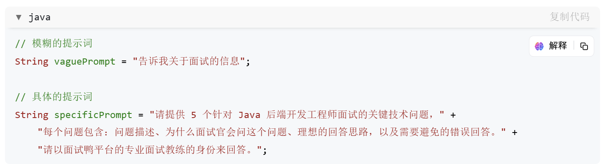
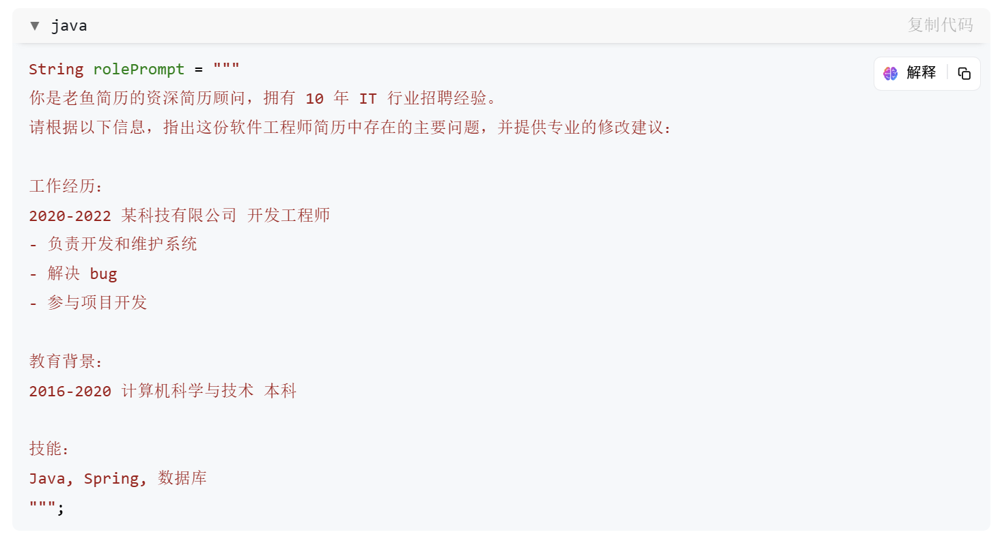
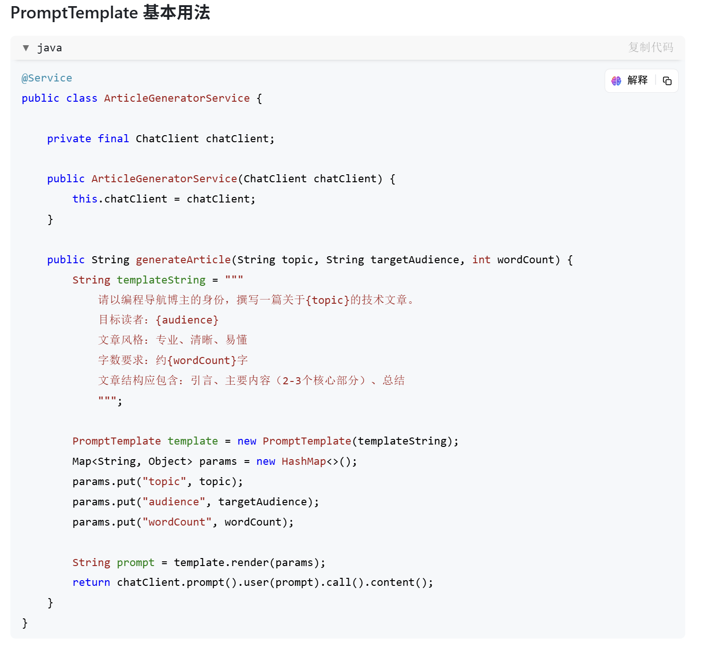
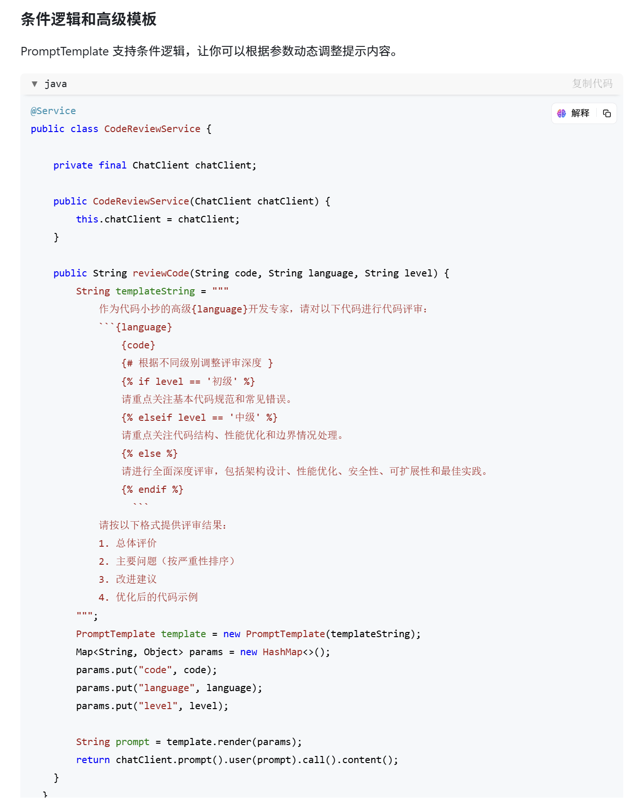
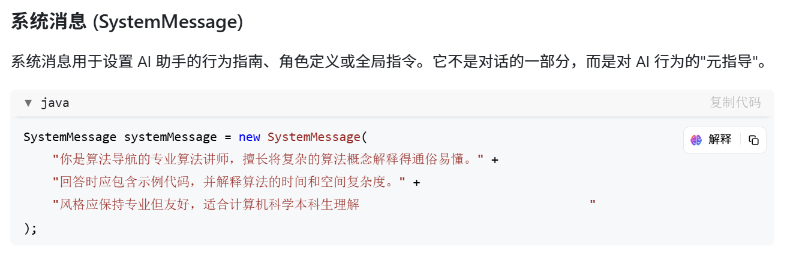
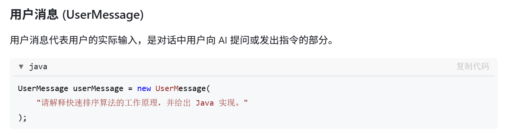
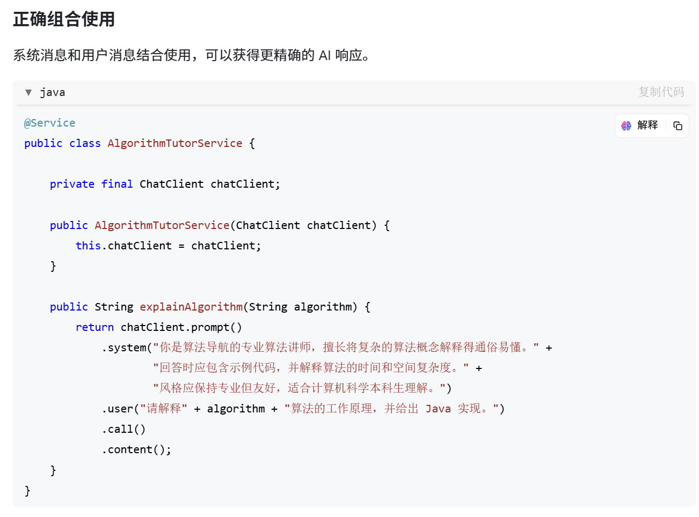

第6章:提示词工程基础

## 6.1什么是提示词工程(Prompt Engineering)

提示词工程是指设计、优化和改进输入到AI模型中的指令(提示词)，以获取高质量、符合预期的输出结果的过程。简单来说，它是人类与AI之间的沟通方式，目的是通过特定的语言和结构引导AI完成任务。

### 提示词工程的重要性

1.降低模型理解成本:即使是高级AI模型，理解人类意图也非常依赖于输入的质量和明确性。
2.提高输出质量:精心设计的提示词能显著提升AI生成内容的相关性、准确性和有用性。
3.节约资源:有效的提示词减少了迭代次数，节省时间和API调用成本。
4.实现复杂功能:通过提示词工程，可以引导AI完成更复杂、更精细的任务，如角色扮演、多步推理等。

### 提示词工程的基本原理

提示词工程基于语言模型的工作原理预测可能的下一个词。通过提供结构化的上下文和明确的指示，我们可以引导模型生成特定类型的内容

## 6.2有效提示词的特点

编写有效的提示词是提示词工程的核心。以下是有效提示词应具备的关键特点:

### 明确性和具体性

提供明确、详细的指令，避免模糊或过于笼统的表述。

### 结构化指令

将复杂任务分解为有序的步骤，提供清晰的结构。

### 角色设定

为AI分配特定的角色或身份，以获取特定风格的回答。

## 6.3使用PromptTemplate创建动态提示

在实际应用中，我们经常需要根据用户输入或系统状态动态生成提示词。Spring AI提供了promptTemplate类来简化这一过程。

## 6.4系统消息与用户消息的区别

在使用LLM时，消息类型对模型行为有很大的影响。SpringAI支持不同类型的消息，主要包括系统消息和用户消息。

## 6.5上下文管理与对话历史

AI对话的质量很大程度上取决于上下文管理。SpringAI提供了灵活的方式来处理对话历史。

### 保持对话上下文

通过将之前的消息包含在提示中，可以让AI了解对话历史，从而给出更连贯的回答。

### 上下文窗口限制处理

语言模型有上下文窗口限制，需要适当管理历史记录长度。

## 6.6常见提示词技巧与模式

以下是一些经过实践证明有效的提示词技巧和模式。

思维链提示(Chainof Thought)
引导AI逐步思考问题，提高推理能力。

> String ‍chainOfThoughtPrompt = """
> 请分析以下算法问题并找出⁡最优解：
> 给定一个整数数组‌，找出其中和最大的连续子数组。
>
> 请按照以下步骤思考：
>
> 1. 首先，分析问题的基本特点和边界条件
> 2. 考虑可能的解法（暴力法、分治法、动态规划等）
> 3. 比较不同方法的时间和空间复杂度
> 4. 确定最优解法
> 5. 用 Java 实现该算法
> 6. 分析算法的复杂度
> 7. 验证算法在示例用例上的正确性
>    """;

零样本、单样本和多样本提示
根据任务复杂度，提供不同数量的示例。

>
> // 零样本提示
> String zeroShotPrompt = "将以下句子从中文翻译成英文：'编程导航是一个帮助程序员学习的平台。'";
>
> // 单样本提示
> String oneS‍hotPrompt = """
> 请根据示例，提供类似的转换：
> 输入：'Java 是一种广泛使用的编程语言。'
> 输出：'Java⁡ is a widely used pro‌gramming language.'
>
> 现在，请转换：'编程导航是一个帮助程序员学习的平台。'
> """;
>
> // 多样本提示
> String multi‍ShotPrompt = """
> 请根据以下示例，进行类似的转换：
> 示例 1:
> 输入：'Java 是一种广泛使用的编程语言。'
> 输出：'J⁡ava is a widely used pr‌ogramming language.'
>
> 示例 2:
> 输入：‍'面试鸭提供编程面试题和答案。'
> 输出：'Mianshiya provides programming⁡ interview questi‌ons and answers.'
>
> 示例 3:
> 输入：‍'老鱼简历帮助求职者制作专业简历。'
> 输出：'Laoyu Resume helps job seeke⁡rs create profess‌ional resumes.'
>
> 现在，请转换：'编程导航是一个帮助程序员学习的平台。'
> """;

结果限制技巧
明确限制输出格式和长度。

> String‍ constrainedPrompt = """
> 请提供 5 个提⁡高 Java 编程技‌能的建议。
> 每个建议必须：
>
> 1. 不超过 20 字
> 2. 以动词开头
> 3. 可以立即执行
> 4. 具体明确
>
> 回答格式必须是带序号的简洁列表，不包含任何额外解释。
> """;
