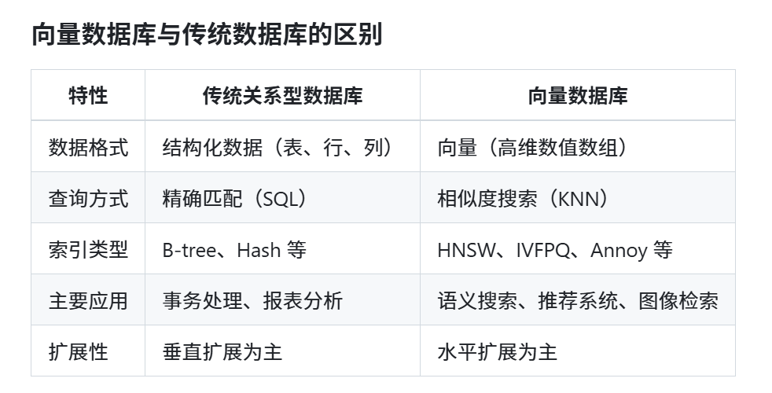

### 第 8 章：向量数据库基础

## 8.1什么是向量数据库，为什么需要它

向量数据库是一种专门设计用来存储、管理和查询向量数据的数据库系统。与传统数据库不同，向量数据库优化了对高维向量的相似性搜索。

### 向量数据库的定义

向量数据库是专门用来存储和检索向量(通常是高维数值数组)的数据库系统，它支持基于向量相似度的查询，可以快速找出与给定向量最相近的其他向量。

### 为什么需要向量数据库

1.语义搜索:传统的关键词搜索无法理解语义，而向量数据库使搜索能够基于语义相似性进行，大幅提升搜索质量。

2.高效的相似性搜索:向量数据库使用特殊的索引算法(如 HNSW、IVFPQ等)，可以在数十亿级别的向量集合中快速找到最相似的向量。

3.大规模AI应用支持:随着AI应用规模的扩大，需要高效的方式来存储和检索大量的向量数据。

4.多模态内容处理:向量数据库可以统一处理文本、图像、音频等不同类型的内容，只要它们能被转换为向量形式。

## 8.2嵌入(Embedding)的概念解析

嵌入(Embedding)是AI领域的核心概念，它是向量数据库的基础。

### 什么是嵌入

嵌入是将复杂数据(如文本、图像、音频等)转换为密集的数值向量的过程。这些向量能够捕获原始数据的语义信息，使得语义相似的内容在向量空间中彼此靠近。

### 嵌入的工作原理

嵌入模型通过深度学习训练，学习如何将输入数据映射到一个高维向量空间。在这个空间中:
.相似的概念拥有相似的向量表示
.向量间的距离(如欧几里得距离、余弦距离)反映了原始数据的语义差异
向量可以用于数学运算，支持语义组合和比较

### 嵌入的应用场景

1.语义搜索:找到与查询语句语义最相关的文档，而不仅仅是包含相同关键词的文档。
2.推荐系统:通过计算用户偏好向量与物品向量的相似度，生成个性化推荐。
3.文本分类:将文本转换为向量，然后使用机器学习算法进行分类。
4.聚类分析:对大量文档进行语义聚类，发现主题和趋势。
5.知识图谱:表示实体和关系的语义特征，支持知识推理。

### 不同类型的嵌入

1.文本嵌入:将单词、句子或文档转换为向量(如Word2Vec、GloVe、BERT、GPT)。
2.图像嵌入:将图像转换为向量(如ResNet、VGG、CLIP)。
3.多模态嵌入:将不同类型的数据(如文本和图像)映射到同一向量空间。

## 8.3常见向量数据库介绍

PostgreSQL + pgvector
Redis + RediSearch
Milvus
Pinecone
Elasticsearch + KNN
