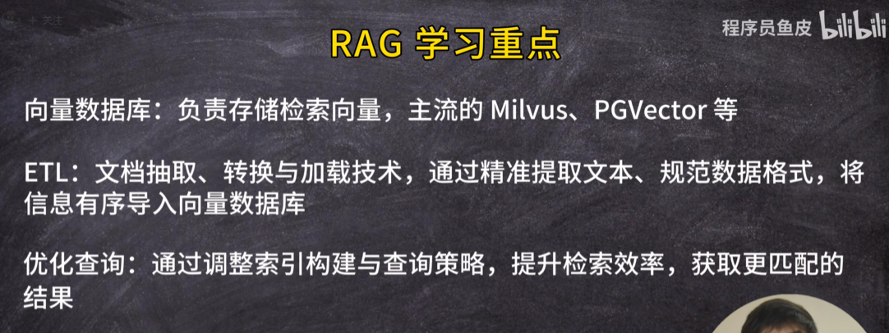
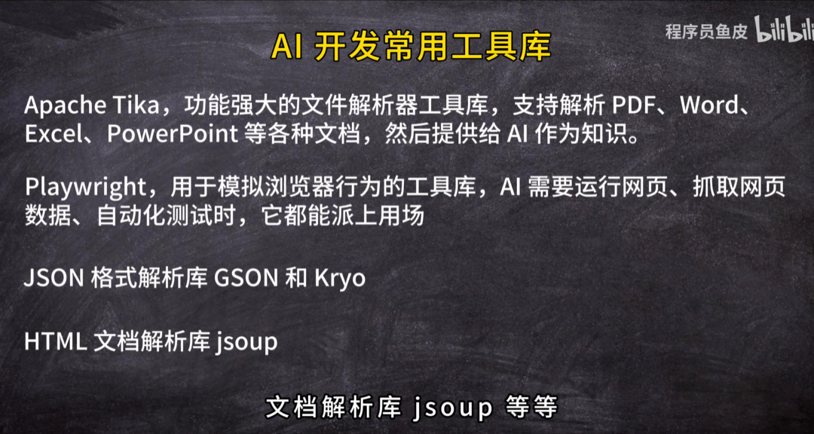
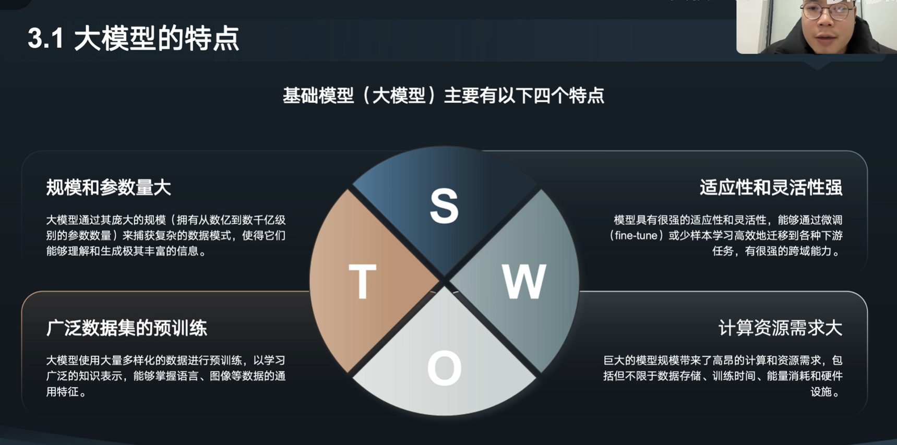
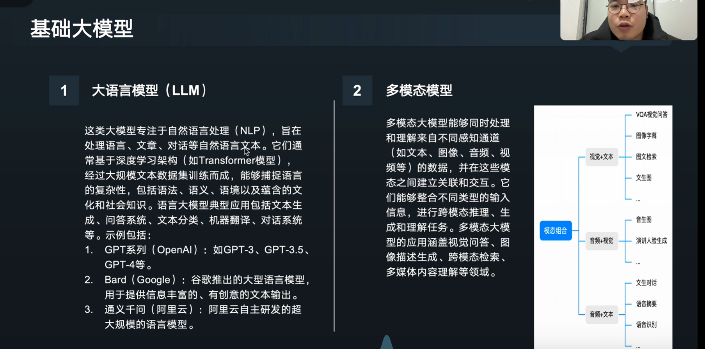
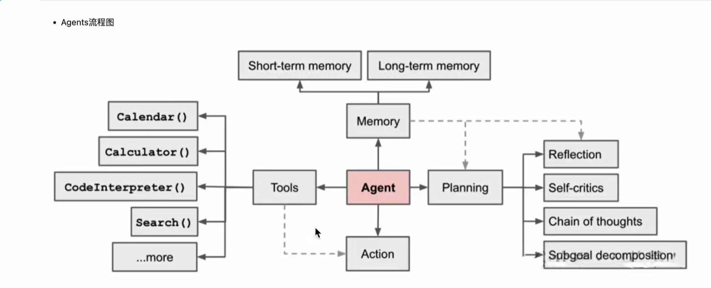
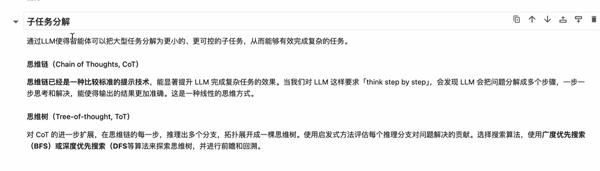
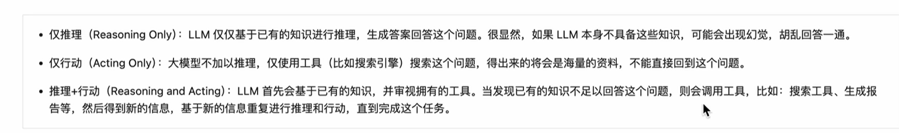

# ai智能体

## 工具

> 有智能体的编辑工具有：idea ，vs，qoder ，trae（阿里）
>
> ```
> qoder： https://qoder.com/
>
> trae：  https://www.trae.cn/
> ```

## 使用

Java 的开发上面的工具都可以使用，使用前最好把jdk和maven环境配置好，不让智能体会为了配置基本环境而耗费很多时间。

# 使用 Docker 本地部署 n8n

> ```
> https://www.docker.com/
>
> 安装n8n：docker pull docker.n8n.io/n8nio/n8n
>
> 启动n8n：
>   docker run -it --rm \
>   --name n8n \
>   -p 5678:5678 \
>   -v n8n_data:/home/node/.n8n \
>   docker.n8n.io/n8nio/n8n
>
> docker stop n8n
> docker start n8n
> ```

# ai时代的来临该怎么办

> 程序员会被淘汰，只有成为ai的操控师

# ai核心概念

大模型 温度 提示词（系统 用户）token 多模态 rag 向量 智能体 智能体工作流   mcp（服务 协议）

# ai编程插件

智谱 CodeGeex , jetbrains assistant ,通义灵码，github copilot等

# ai开发工具

数据库：chat2db  git：warp ai

文本作图

# ai使用技巧

如何使用ai生成代码更准确：

1、明确AI的角色:比如 "你是一位Java程序员，只会写Bug"

2、提供细节要求:比如"写一篇300字的文章，突出专业性"

3、拆解任务:比如"先需求分析，再技术选型，最后编码实现，并生成项目总结"

4、提供示例:比如"模仿李白的<<静夜思>>，创作一首表达思乡之情的五言诗歌"

智谱AI ：开发文档可以参考

报需求提交给ai，生成具体计划，再去生成

复杂项目的生成技巧：

分部迭代

划分功能

再详细开发

大项目拆解小项目

限制范围

版本控制：提交代码

# 自主开发ai项目

Spring A  和 LangChain4j 相似 LangChain4j 更复杂
LangGraph 用图的结构 管理 工作流 ，如负责人管理其他智能体

# ai业务能力

RAG 多模态 MCP ReAct




ReAct：拆解为下面图步骤：

任务规划,工具调用,交互io,异常处理




# 人工智能

机器学习

深度学习：模拟大脑的工作方式

## 大模型

预习训练 sft（简单微调） rlhf（反馈的强化学习）

### 大模型的特点


### 大模型的分类
大语言模型 多模态模型


### 大模型的工作流程
分词 概率链接下个词 

# agent







自洽陷阱 - 》 从众

