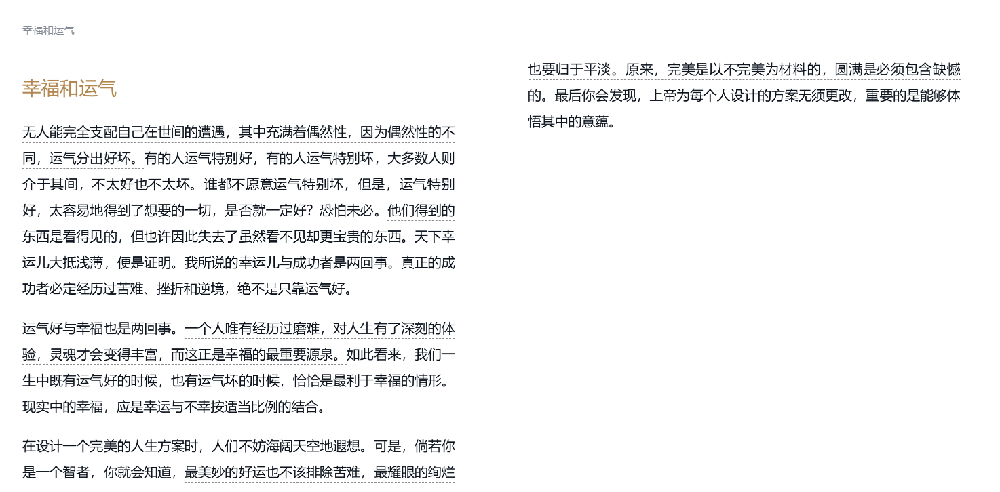

但他在垂暮之年却说：“生活给了我想要的东西，同时它又让我认识到这没多大意思。不过你有什么办法？”

自古以来，无论在文学作品中，还是在现实生活中，爱情和婚姻始终被视为个人幸福之命脉所系。多少幸福或不幸的喟叹，都缘此而起。按照孔德的说法，女人是感情动物，爱情和婚姻对于女人的重要性自不待言。但即使是行动动物的男人，在事业上获得了辉煌的成功，倘若在爱情和婚姻上失败了，他仍然会觉得自己非常不幸。

诚然，热恋中的情人个个都觉得自己是幸福女神的宠儿，但并非人人都能得到热恋的机遇，有许多人一辈子也没有品尝过个中滋味。况且热恋未必导向美满的婚姻，婚后的失望、争吵、厌倦、平淡、麻木几乎是常规，终身如恋人一样缱绻的夫妻毕竟只是幸运的例外。

---- 摘抄《周国平孤独三书》
