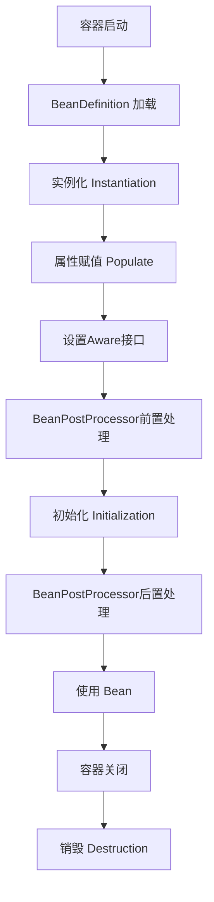

Spring Bean 的生命周期主要包括以下几个阶段：

1.  **实例化 (Instantiation)**：Spring 容器根据 Bean 定义创建一个 Bean 实例（通过构造函数）。
2.  **属性填充 (Populate properties)**：Spring 容器为 Bean 实例注入属性值（依赖注入），如通过 Setter 方法或字段注入。
3.  **BeanNameAware 接口回调 (Invoke `setBeanName`)**：如果 Bean 实现了 `BeanNameAware` 接口，Spring 会调用 `setBeanName()` 方法，传入 Bean 的 ID。
4.  **BeanFactoryAware / ApplicationContextAware 接口回调 (Invoke `setBeanFactory`/`setApplicationContext`)**：
    *   如果 Bean 实现了 `BeanFactoryAware` 接口，Spring 会调用 `setBeanFactory()` 方法，传入当前的 `BeanFactory` 实例。
    *   如果 Bean 实现了 `ApplicationContextAware` 接口，Spring 会调用 `setApplicationContext()` 方法，传入当前的 `ApplicationContext` 实例。
5.  **BeanPostProcessor 前置处理 (Pre-initialization by `BeanPostProcessor`)**：如果容器中存在 `BeanPostProcessor` 实例，会调用其 `postProcessBeforeInitialization()` 方法。
6.  **InitializingBean 接口回调 (Invoke `afterPropertiesSet`)**：如果 Bean 实现了 `InitializingBean` 接口，Spring 会调用其 `afterPropertiesSet()` 方法。
7.  **自定义初始化方法 (Custom initialization method)**：如果 Bean 在配置中指定了 `init-method` 方法，或使用了 `@PostConstruct` 注解，Spring 会调用相应的初始化方法。
8.  **BeanPostProcessor 后置处理 (Post-initialization by `BeanPostProcessor`)**：如果容器中存在 `BeanPostProcessor` 实例，会调用其 `postProcessAfterInitialization()` 方法。
9.  **Bean 就绪 (Bean is ready for use)**：此时 Bean 已完全初始化，可以投入使用。
10. **容器关闭阶段**：
    *   **DisposableBean 接口回调 (Invoke `destroy`)**：如果 Bean 实现了 `DisposableBean` 接口，Spring 会调用其 `destroy()` 方法。
    *   **自定义销毁方法 (Custom destroy method)**：如果 Bean 在配置中指定了 `destroy-method` 方法，或使用了 `@PreDestroy` 注解，Spring 会调用相应的销毁方法。
*   


Spring Bean 的生命周期是 Spring 框架的核心机制之一，理解它对于掌握 Spring 的 IOC 容器和 AOP 等功能至关重要。Bean 的生命周期从容器启动开始，到容器销毁结束，期间经历了多个关键阶段。

以下是 Spring Bean 生命周期的完整流程：

## 📊 Bean 生命周期核心流程图


-------------------------------------------------------------------------------------------------

## 🔄 详细阶段说明

### 阶段 1：Bean 元信息加载
Spring 容器（ApplicationContext）启动时，会读取配置（XML、Java Config 或注解），创建 **BeanDefinition** 对象，它描述了 Bean 的所有元信息。

```java
// BeanDefinition 包含的信息
BeanDefinition {
    beanClassName,      // Bean 的类名
    scope,             // 作用域：singleton、prototype 等
    lazyInit,          // 是否延迟加载
    initMethodName,    // 初始化方法
    destroyMethodName, // 销毁方法
    propertyValues,    // 属性值
    constructorArguments, // 构造器参数
    // ...
}
```

### 阶段 2：实例化（Instantiation）
容器通过反射调用构造方法创建 Bean 的实例。

```java
// 伪代码展示实例化过程
if (有构造器参数) {
    beanInstance = constructor.newInstance(args);
} else {
    beanInstance = clazz.newInstance();
}
```

### 阶段 3：属性赋值（Populate Properties）
容器将配置的属性值（包括依赖的其他 Bean）注入到 Bean 实例中。

```java
// 例如通过 setter 方法注入
public class UserService {
    private UserDao userDao;
    
    // setter 注入
    public void setUserDao(UserDao userDao) {
        this.userDao = userDao;
    }
}
```

### 阶段 4：Aware 接口回调
如果 Bean 实现了特定的 **Aware 接口**，容器会调用相应的方法：

```java
@Component
public class MyBean implements BeanNameAware, BeanFactoryAware, 
                               ApplicationContextAware {
    
    @Override
    public void setBeanName(String name) {
        // 获取 Bean 的名称
    }
    
    @Override
    public void setBeanFactory(BeanFactory beanFactory) {
        // 获取 BeanFactory
    }
    
    @Override
    public void setApplicationContext(ApplicationContext applicationContext) {
        // 获取 ApplicationContext
    }
    
    // 其他 Aware 接口：
    // - EnvironmentAware: 获取环境变量
    // - ResourceLoaderAware: 获取资源加载器
    // - ApplicationEventPublisherAware: 获取事件发布器
}
```

### 阶段 5：BeanPostProcessor 前置处理
**BeanPostProcessor** 是 Spring 的重要扩展点，每个 Bean 在初始化前后都会经过它的处理。

```java
@Component
public class MyBeanPostProcessor implements BeanPostProcessor {
    
    @Override
    public Object postProcessBeforeInitialization(Object bean, String beanName) {
        // 在初始化方法调用之前执行
        // 可以在这里对 Bean 进行修改
        return bean;
    }
    
    @Override
    public Object postProcessAfterInitialization(Object bean, String beanName) {
        // 在初始化方法调用之后执行
        // AOP 代理就是在这里生成的
        return bean;
    }
}
```

### 阶段 6：初始化（Initialization）
这个阶段会执行 Bean 的初始化方法，按照以下顺序：

```java
@Component
public class ExampleBean implements InitializingBean {
    
    // 1. @PostConstruct 注解的方法（JSR-250 规范）
    @PostConstruct
    public void postConstruct() {
        System.out.println("1. @PostConstruct 方法执行");
    }
    
    // 2. InitializingBean 接口的 afterPropertiesSet 方法
    @Override
    public void afterPropertiesSet() throws Exception {
        System.out.println("2. InitializingBean.afterPropertiesSet() 执行");
    }
    
    // 3. 自定义的 init-method（通过 XML 或 @Bean 注解指定）
    public void customInit() {
        System.out.println("3. 自定义 init-method 执行");
    }
}
```

配置方式：
```java
@Configuration
public class AppConfig {
    @Bean(initMethod = "customInit")
    public ExampleBean exampleBean() {
        return new ExampleBean();
    }
}
```

### 阶段 7：BeanPostProcessor 后置处理
在初始化方法之后，BeanPostProcessor 的后置处理方法会被调用。**这是 AOP 代理生成的关键时机**。

```java
@Override
public Object postProcessAfterInitialization(Object bean, String beanName) {
    // 如果 Bean 需要被代理（如有 @Transactional, @Async 等注解）
    if (needProxy(bean)) {
        return createProxy(bean);  // 创建代理对象
    }
    return bean;
}
```

### 阶段 8：Bean 就绪使用
此时 Bean 已经完全初始化，可以被应用程序使用。

```java
// 从容器获取 Bean
ApplicationContext context = ...;
UserService userService = context.getBean(UserService.class);
userService.doSomething();
```

### 阶段 9：销毁（Destruction）
当容器关闭时，Bean 的销毁方法会按顺序执行：

```java
@Component
public class ExampleBean implements DisposableBean {
    
    // 1. @PreDestroy 注解的方法（JSR-250 规范）
    @PreDestroy
    public void preDestroy() {
        System.out.println("1. @PreDestroy 方法执行");
    }
    
    // 2. DisposableBean 接口的 destroy 方法
    @Override
    public void destroy() throws Exception {
        System.out.println("2. DisposableBean.destroy() 执行");
    }
    
    // 3. 自定义的 destroy-method
    public void customDestroy() {
        System.out.println("3. 自定义 destroy-method 执行");
    }
}
```

## 🎯 Bean 作用域的影响

不同的 Bean 作用域会影响生命周期：

| 作用域 | 说明 | 生命周期特点 |
|--------|------|-------------|
| **singleton** | 单例（默认） | 容器启动时创建，容器关闭时销毁 |
| **prototype** | 原型 | 每次获取时创建，容器不管理销毁 |
| **request** | Web 请求 | 每个 HTTP 请求创建，请求结束销毁 |
| **session** | Web 会话 | 每个 HTTP 会话创建，会话结束销毁 |
| **application** | Web 应用 | ServletContext 生命周期内单例 |

## 💡 生命周期扩展接口总结

| 接口/注解 | 执行时机 | 用途 |
|-----------|----------|------|
| **BeanPostProcessor** | 每个 Bean 初始化前后 | 对 Bean 进行修改或包装 |
| **InstantiationAwareBeanPostProcessor** | 实例化前后、属性设置前 | 更细粒度的实例化控制 |
| **SmartInstantiationAwareBeanPostProcessor** | 实例化前确定 Bean 类型 | 确定 Bean 的实际类型 |
| **BeanFactoryPostProcessor** | BeanDefinition 加载后 | 修改 Bean 的定义信息 |
| **@PostConstruct** | 依赖注入完成后 | 初始化逻辑 |
| **@PreDestroy** | Bean 销毁前 | 清理资源 |
| **InitializingBean** | 属性设置完成后 | 初始化逻辑 |
| **DisposableBean** | Bean 销毁时 | 清理资源 |
| **各种 Aware 接口** | Bean 初始化早期 | 获取 Spring 容器组件 |

## 🚀 实际应用示例

```java
@Component
public class DatabaseConnection implements 
        BeanNameAware, InitializingBean, DisposableBean {
    
    private String beanName;
    private Connection connection;
    
    @Override
    public void setBeanName(String name) {
        this.beanName = name;
        System.out.println("Bean 名称: " + beanName);
    }
    
    @PostConstruct
    public void init() {
        System.out.println("1. 建立数据库连接");
        this.connection = DriverManager.getConnection(...);
    }
    
    @Override
    public void afterPropertiesSet() {
        System.out.println("2. 验证数据库连接");
        if (!connection.isValid(5)) {
            throw new RuntimeException("数据库连接无效");
        }
    }
    
    public void queryData() {
        // 使用连接执行查询
    }
    
    @PreDestroy
    public void cleanup() {
        System.out.println("1. 开始清理资源");
    }
    
    @Override
    public void destroy() {
        System.out.println("2. 关闭数据库连接");
        if (connection != null) {
            connection.close();
        }
    }
}
```

## 🔧 调试生命周期

可以通过在 `application.properties` 中启用调试日志来观察 Bean 的生命周期：

```properties
# 查看 Bean 生命周期日志
logging.level.org.springframework.beans=DEBUG
logging.level.org.springframework.context=DEBUG
```

或者通过实现 `BeanPostProcessor` 来跟踪：

```java
@Component
public class LifecycleLogger implements BeanPostProcessor {
    
    @Override
    public Object postProcessBeforeInitialization(Object bean, String beanName) {
        System.out.println("初始化前: " + beanName + " - " + bean.getClass());
        return bean;
    }
    
    @Override
    public Object postProcessAfterInitialization(Object bean, String beanName) {
        System.out.println("初始化后: " + beanName);
        return bean;
    }
}
```

理解 Bean 的生命周期对于解决 Spring 应用中的各种问题非常重要，比如：
1. 依赖注入失败的时机
2. AOP 代理为什么有时不生效
3. 如何正确初始化资源和清理资源
4. 如何扩展 Spring 容器的功能

掌握这些知识，能让你更深入地理解 Spring 的工作原理，并在实际开发中灵活运用。